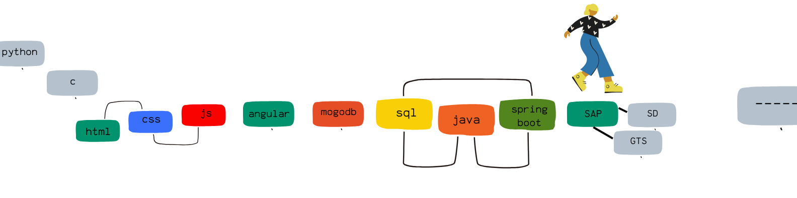
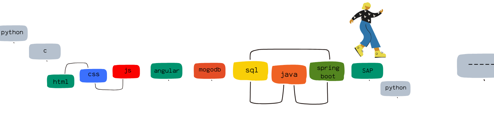

<div > 
<!--      align="center" -->
<!--      <a href="" target="_blank"></a> -->
<!--
     <a href="https://www.linkedin.com/in/susanandrews?lipi=urn%3Ali%3Apage%3Ad_flagship3_profile_view_base_contact_details%3BZoes3PEWR5iEL1XLC2aftw%3D%3D"     target="_blank"></a>   
    <a href="https://susan-andrews.github.io/" target="_blank"></a> 
     <a href=""></a>
     <a href="https://www.freecodecamp.org/Susan-Andrews"></a>  
   <a href="https://www.codechef.com/users/annsusan01" target="_blank"></a>
     <a href="https://replit.com/@susanandrews123" target="_blank"></a> 
  <a href="https://www.hackerrank.com/susanandrews2001" target="_blank"></a>   
</div>
-->

<br>  
<!-- <div align='center'> <span  style="font-family:Papyrus; font-size:8em;">
      HACKTOBER-23
</span>  
</div>
 -->


```bash
I'll be back, watch out!
```
<br>



<div > 


<!--
[](https://holopin.io/@susanandrews)
--!>

<!--
𝑷𝒆𝙧𝒔𝒐𝒏𝒂𝒍𝒊𝙨𝒆 𝒚𝒐𝙪𝒓 𝒊𝒅𝒆𝙣𝙩𝙞𝙩𝒚
--!>
